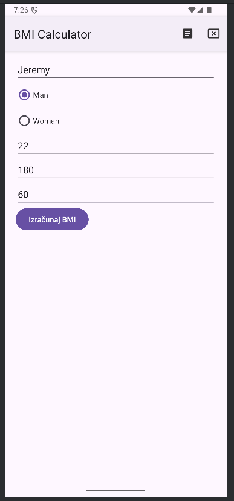
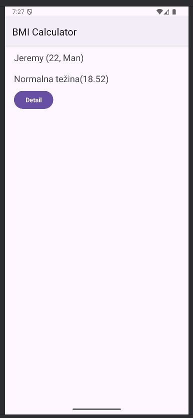
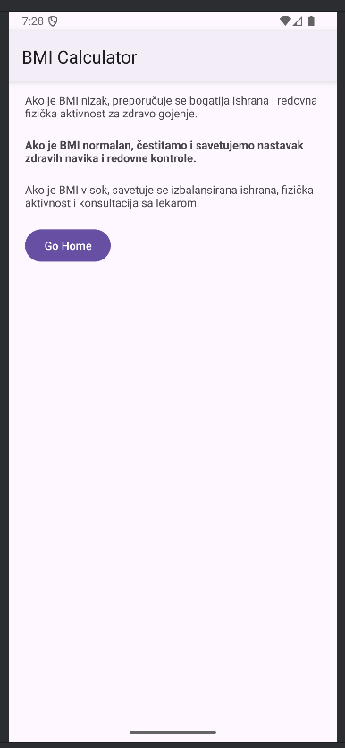

# BMI Calculator

> This is a school homework project. It is created for educational purposes only and is not intended for commercial use.

## 📁 Main Files

### Scripts

- [MainActivity.java](app/src/main/java/com/example/mbi_calculator/MainActivity.java)
- [DetailActivity.java](app/src/main/java/com/example/mbi_calculator/DetailActivity.java)
- [ResultActivity.java](app/src/main/java/com/example/mbi_calculator/ResultActivity.java)
---
- [BMIResult.java](app/src/main/java/com/example/mbi_calculator/ResultActivity.java) (for intent Extra)

### Activities

- [activity_main.xml](/app/src/main/res/layout/activity_main.xml)
- [activity_result.xml](/app/src/main/res/layout/activity_result.xml)
- [activity_detail.xml](/app/src/main/res/layout/activity_detail.xml)

## Screenshots

| activity_main.xml | activity_result.xml | activity_detail.xml |
| --- | --- | --- |
|  |  | 